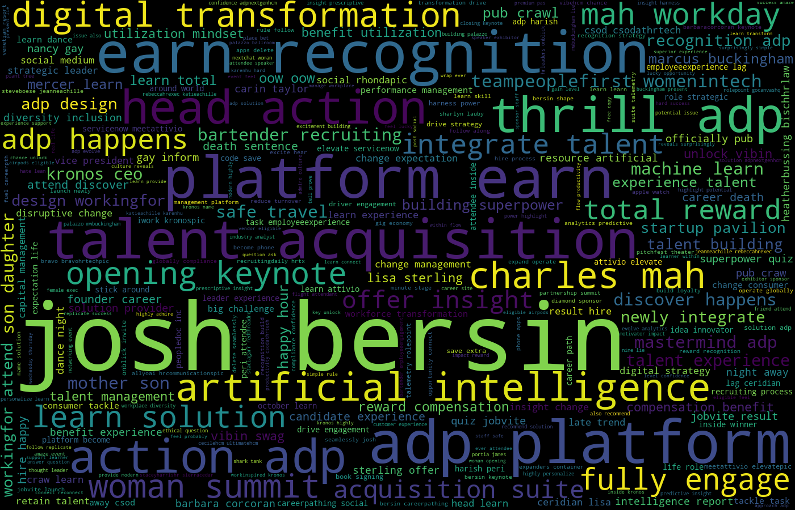

# Auto Generated Insights of 2019 HR Tech Conference Twitter
 

I scrape tweets with #[HRTechConf](https://www.hrtechnologyconference.com/), and build Latent Dirichlet Allocation (LDA) model for auto detecting and interpreting topics in the tweets. Here is my pipeline:

1. Data gathering – twitter scrape
2. Data pre-processing
3. Generating word cloud
4. Train LDA model
5. Visualizing topics

## Install

This project requires **Python 3.6+** and the following Python libraries installed:

- [TwitterScraper](https://github.com/taspinar/twitterscraper), a Python script to scrape for tweets
- [NLTK](http://www.nltk.org/)(Natural Language Toolkit), a NLP package for text processing, e.g. stop words, punctuation, tokenization, lemmatization, etc.
- [Gensim](https://radimrehurek.com/gensim/), “generate similar”, a popular NLP package for topic modeling
- [Latent Dirichlet Allocation (LDA)](https://en.wikipedia.org/wiki/Latent_Dirichlet_allocation), a generative, probabilistic model for topic clustering/modeling
- [pyLDAvis](https://github.com/bmabey/pyLDAvis), an interactive LDA visualization package, designed to help interpret topics in a topic model that is trained on a corpus of text data
- [NumPy](http://www.numpy.org/)
- [Pandas](http://pandas.pydata.org)
- [matplotlib](http://matplotlib.org/)

## Code

Code is provided in `HRTech2019_LDA.py`. 
